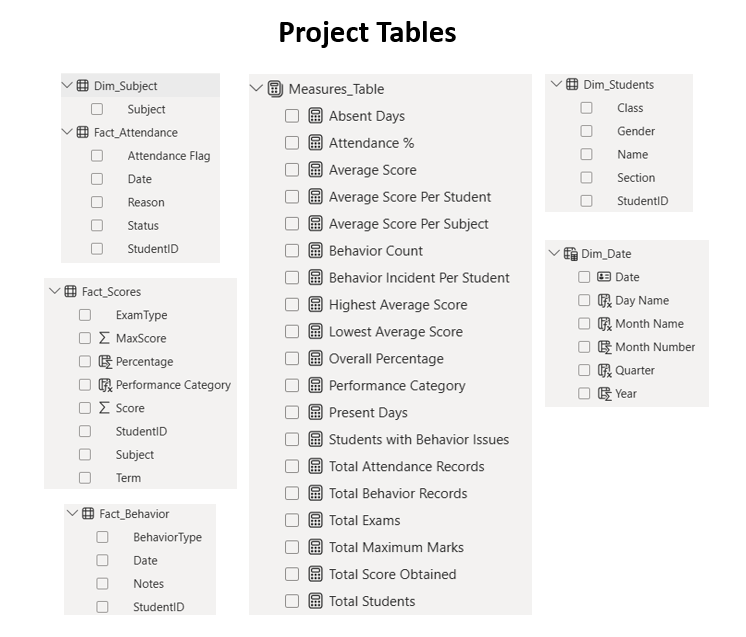
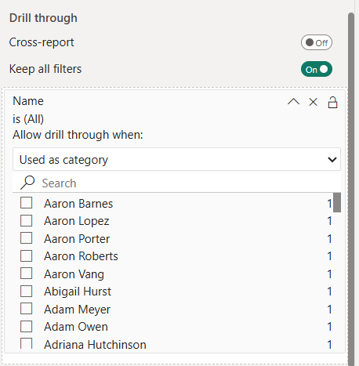

# 🎓 Student Performance, Attendance & Behavior Analytics Dashboard — Power BI

An end-to-end Power BI analytics solution that unifies academic performance, attendance, and behavior data for 1,000+ students into one connected reporting system.

Built on a proper Star Schema, a comprehensive DAX layer, and three interlinked dashboards with drillthrough navigation down to the individual student — designed the way a school's data team would actually need it, not as a single flat report.

---

## 📌 Project Overview

Schools generate three separate streams of data — grades, attendance registers, and behavior logs — that usually exist in disconnected spreadsheets.

This project integrates all three into a unified analytical model, enabling stakeholders to understand academic outcomes beyond test scores alone. Attendance gaps and behavior incidents are analyzed alongside academic performance to provide a complete student view.

The solution answers three critical business questions:

Business Question| Dashboard
How are students performing academically, and where are the weak spots?| Academic Performance Dashboard
Are attendance or conduct issues affecting academic outcomes, and where should intervention happen first?| Attendance & Behavior Dashboard
What does the complete picture look like for one specific student?| Student Detailed Analysis (Drillthrough)

---

## 🗂️ Data Model — Star Schema

The data model follows a clean Star Schema architecture rather than a single wide table.

### Dimension Tables

- Dim_Students
- Dim_Date
- Dim_Subject

### Fact Tables

- Fact_Scores
- Fact_Attendance
- Fact_Behavior

### Model Highlights

✔ Dim_Students and Dim_Date act as universal filters connected to all fact tables.

✔ Each fact table captures one event type per row.

✔ Shared dimensions enable simultaneous filtering across academic, attendance, and behavior domains.

### Why Star Schema Matters

Because all fact tables share common dimensions, filtering by:

- Student
- Class
- Term
- Date

automatically filters scores, attendance, and behavior together.

This enables powerful analytical questions such as:

### «Do students with poor attendance also perform poorly academically?»

A flat-table model cannot answer such questions effectively.

---

## 🧮 DAX Layer — The Logic Behind Every Number

Every KPI in the report is powered by explicit DAX measures organized within a dedicated Measures Table.

Key DAX Concepts Used

### 📅 Dynamic Calendar Table

A dynamic calendar is generated using:

Dim_Date =
CALENDAR(
    MIN(Fact_Attendance[Date]),
    MAX(Fact_Attendance[Date])
)

This ensures the date table automatically expands whenever new data is loaded.

### ➗ Safe Percentage Calculations

Metrics such as Attendance % and Overall Percentage use:

DIVIDE()

to safely handle divide-by-zero scenarios.

### 👨‍🎓 Accurate Student Averaging

Student averages are calculated using:

AVERAGEX(
    VALUES(Dim_Students[StudentID]),
    [Average Score]
)

This prevents students with more exam records from disproportionately influencing the overall average.

### 🏆 Dynamic High and Low Performer Detection

Highest and lowest performers are identified dynamically using:

- MAXX()
- MINX()
- VALUES()
- CALCULATE()

These measures automatically recalculate based on current filters and slicers.

### 🎯 Consistent Performance Banding

Students are classified into:

Percentage| Category
≥ 80%| High
≥ 50%| Medium
< 50%| Low

using:

SWITCH(TRUE())

ensuring consistency across both summary KPIs and row-level analysis.

---

## 📊 Dashboard 1 — Academic Performance Analysis

Built For

- Academic Heads
- Principals
- Department Coordinators

### Business Question

### «Where is academic risk concentrated, and is it tied to a specific subject, class, or term?»

### Insights Delivered

- KPI cards provide a complete academic health snapshot.
- Subject-wise analysis identifies weak academic areas.
- Term trend analysis tracks performance changes over time.
- Conditional formatting transforms student tables into actionable intervention lists.

### Typical Use Cases

- Academic review meetings
- Parent-teacher preparation
- Cohort performance analysis
- Student intervention planning

---

## 📊 Dashboard 2 — Attendance & Behavior Analysis

Built For

- Counselors
- Discipline Coordinators
- School Administrators

### Business Question

### «Are attendance and behavior issues contributing to academic risk?»

### Insights Delivered

- Attendance trends reveal absenteeism patterns.
- Behavior distribution highlights conduct trends.
- Top incident students become immediate counselor worklists.
- Heatmap analysis identifies classes requiring intervention.

### Typical Use Cases

- Weekly discipline reviews
- Attendance monitoring
- Early risk identification
- Conduct analysis

---

## 📊 Dashboard 3 — Student Detailed Analysis (Drillthrough)

Built For

- Teachers
- Counselors
- Parent-Teacher Meetings

### Business Question

### «What is the complete picture of a student across academics, attendance, and behavior?»

### Key Features

✔ Drillthrough navigation from Dashboard 1 and Dashboard 2.

✔ Filter context preservation using:

- Keep all filters = ON
- Used as category = ON

✔ One-click access to complete student history.

### Insights Delivered

- Subject-wise academic performance
- Attendance status analysis
- Behavior distribution
- Individual exam records

### Typical Use Cases

- Parent-teacher conferences
- Individual case reviews
- Student counseling sessions

---

### 🧭 Navigation Design

All dashboards share a consistent footer navigation experience built using:

- Page Navigator Buttons
- Bookmarks
- Drillthrough Navigation

This creates an application-like experience instead of relying on default Power BI page tabs.

---

## 🛠️ Tech Stack

Category| Technology
Visualization| Power BI Desktop
Data Transformation| Power Query
Data Modeling| Star Schema
Analytics| DAX
Navigation| Drillthrough Navigation
Reporting| Interactive Dashboards
Formatting| Conditional Formatting

---

## 🚀 Why This Project Stands Out

✅ Built using a true Star Schema rather than a flat table.

✅ Uses advanced DAX functions such as CALCULATE, DIVIDE, AVERAGEX, MAXX, MINX, and SWITCH(TRUE()).

✅ Implements Drillthrough Navigation with filter-context preservation.

✅ Connects academics, attendance, and behavior into a unified analytical solution.

✅ Every dashboard is designed around a specific stakeholder and business question.

---

## 👩‍💻 Author

Iqra Rangrej

Skills: Power BI | Power Query | DAX | Data Modeling | Star Schema | Data Visualization | Business Intelligence